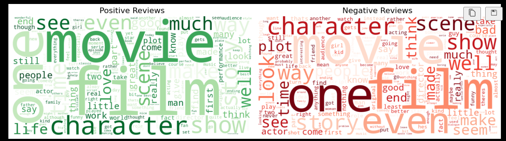
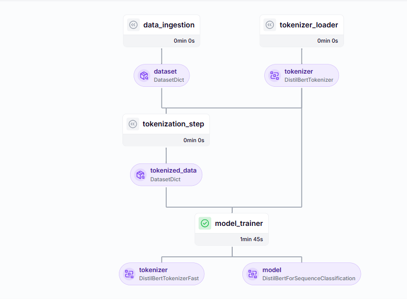
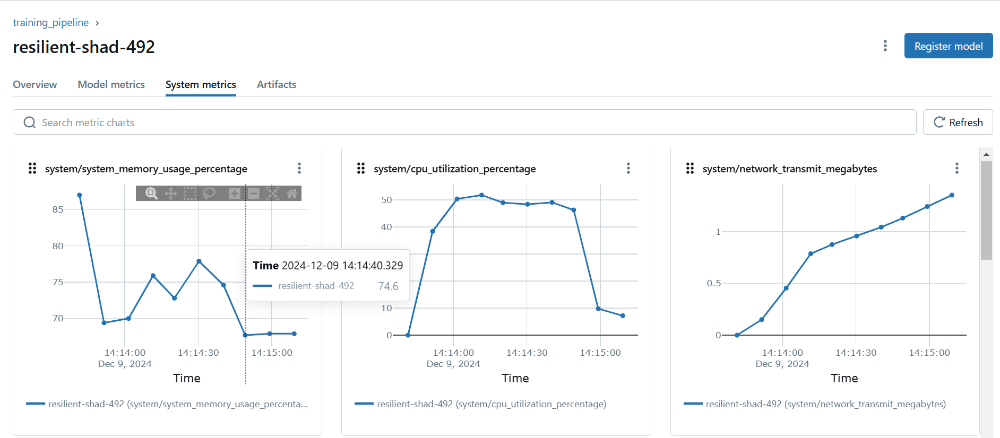
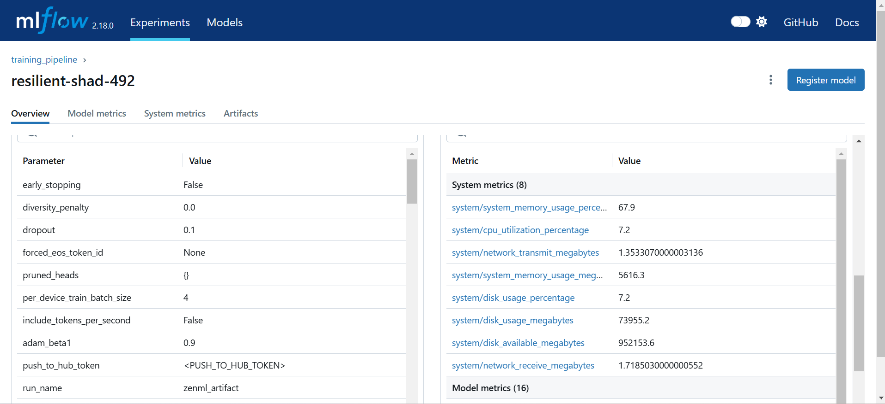
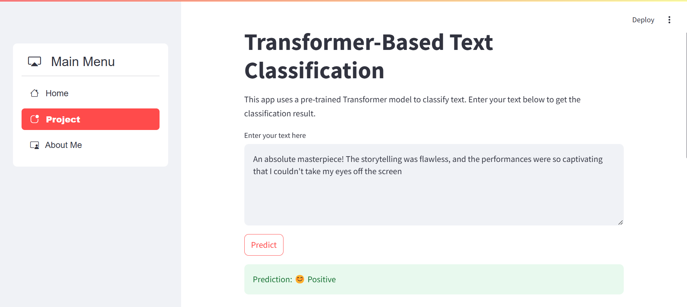
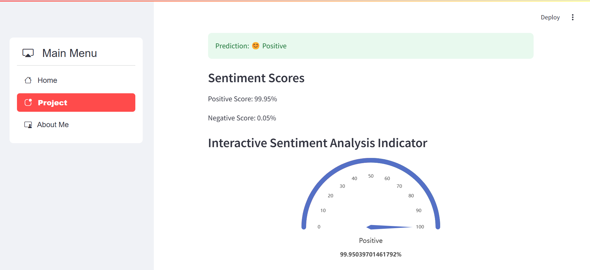
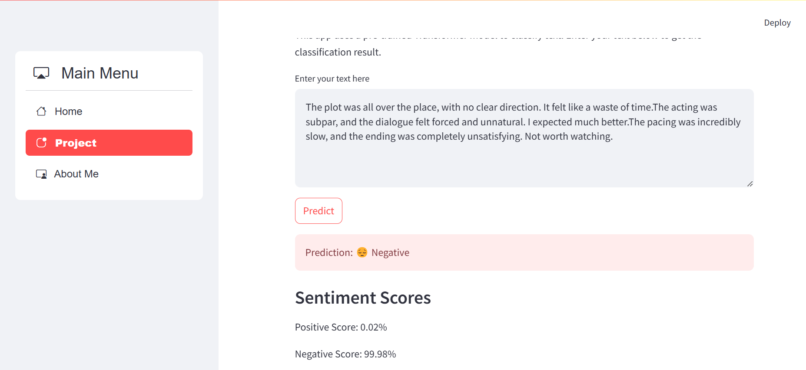
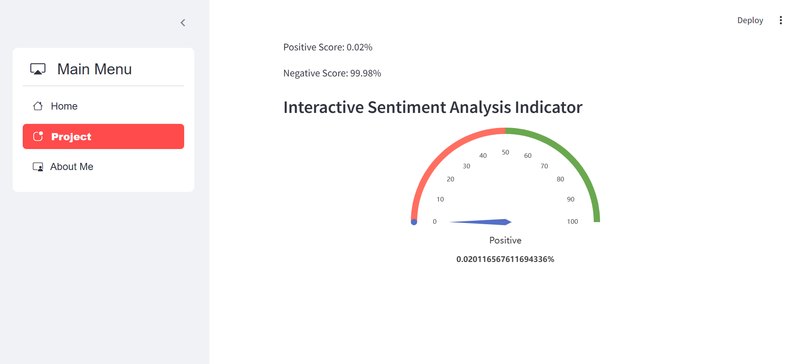
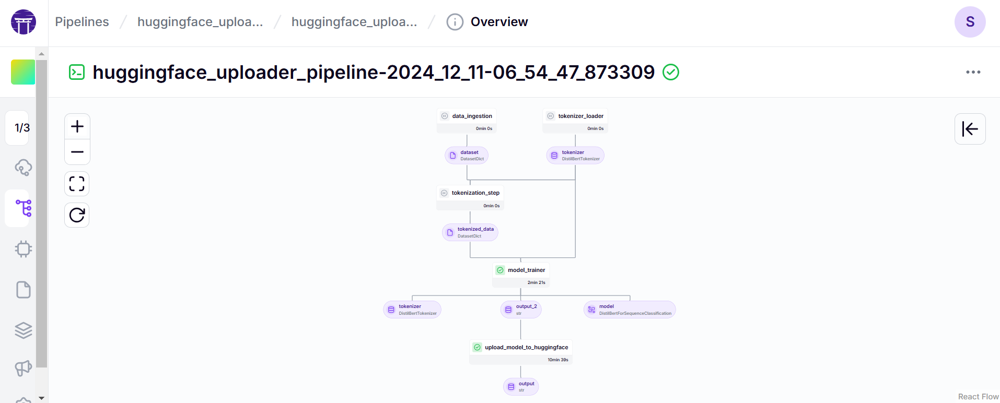
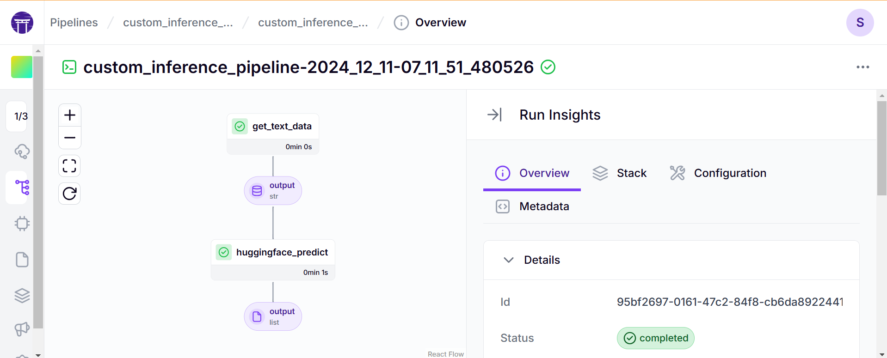

# IMDb Review Sentiment Analysis 🎥📊

## 📄 Problem Statement
The aim of this project is to classify IMDb movie reviews into **positive** or **negative** sentiment categories. With a review as input, the model predicts the sentiment, enabling applications such as **customer feedback analysis**, **social media sentiment tracking**, and **sentiment-based recommendations**.

---

## 🎯 Objective
To develop a **Transformer-based Sentiment Analysis Pipeline** that:
1. **Processes raw text** from IMDb movie reviews.
2. **Classifies text** into positive or negative sentiment.
3. Provides an interactive **user-friendly interface** for predictions.

---

## 🛠️ Technological Stack
This project leverages the following tools and technologies:

### Programming & Libraries
- **Python** 🐍: Backend logic and scripting.
- **Hugging Face Transformers** 🤗: State-of-the-art pre-trained language models for seamless model integration and fine-tuning.
- **PyTorch** 🔥: Deep learning computations and model operations.

### Development Tools
- **Streamlit**: For building a web-based interactive user interface.
- **ZenML** 🛠️: MLOps pipeline automation, including data ingestion and model deployment.
- **MLflow** 📊: Experiment tracking, model versioning, and performance monitoring.
- **Hugging Face** 🤗: For model deployment and application deployment.

### Deployment Tools
- **Docker** 🐳: Containerizing the application for scalable deployment.

---

## 📚 Dataset Overview
The dataset used in this project is the **IMDb Movie Reviews Dataset**, comprising 50,000 labeled movie reviews:
- **Positive Sentiment** 😊: Reviews reflecting satisfaction.
- **Negative Sentiment** 😔: Reviews expressing dissatisfaction.



### Challenges in the Dataset
- **Noisy Text**: Reviews contain HTML tags, links, emojis, and special characters requiring preprocessing.
- **Ambiguity in Sentiments**: Mixed sentiments in some reviews pose challenges for classification.

---

## 🏗️ Project Architecture
The project follows a structured workflow:
1. **Data Loader**:
   - Load dataset and preprocess reviews.
2. **Tokenizer Loader**:
   - Load tokenizer and tokenize text data.
3. **Model Training**:
   - Fine-tune pre-trained Hugging Face Transformers on the IMDb dataset.
4. **Evaluation**:
   - Measure performance using metrics like accuracy, precision, recall, and F1 score, tracked with MLflow.
5. **Deployment**:
   - Build scalable MLOps pipelines using ZenML and deploy with huggingface.
6. **User Interface**:
   - Enable real-time text classification via a Streamlit-based web app.

---

## 🌟 Features
- **Real-Time Sentiment Prediction**: Classify movie reviews with confidence scores.
- **Intuitive UI**: Interactive app for ease of use.
- **Scalable and Reproducible**: Dockerized setup for seamless deployment.
- **MLOps Integration**: Automated workflows with ZenML and experiment tracking with MLflow.

---

## 📷 Visualizations

### **ZenML Pipeline Dashboard**
Below is a screenshot of the ZenML Pipeline dashboard showing the sentiment analysis workflow:



### **MLflow Dashboard**
#### **System Metrics**
This screenshot displays the system metrics (CPU, Memory, etc.) tracked during the training and evaluation phases:



#### **Model Metrics**
The following screenshot showcases the model's performance metrics such as accuracy, precision, recall, and F1 score:



### **Streamlit WebApp**
#### **1. Homepage**
The homepage provides a user-friendly interface to input reviews for sentiment analysis:



#### **2. Sentiment Output**
The sentiment prediction output with confidence scores is displayed:




For Negative Sentiment 


#### **3. Sentiment Output**
The sentiment prediction output with confidence scores is displayed:



---

## 🚀 Model Deployment on Hugging Face Hub
The trained model has been uploaded to the **Hugging Face Hub** for public use. You can access it via the following link:

👉 [Trained Sentiment Analysis Model on Hugging Face](https://huggingface.co/Sarathkumar1304ai/sentiment_analysis)

Use this model to make predictions or integrate it into your own applications.

---

## 📥 How to Run the Project
1. Clone the repository:
   ```
   mkdir nlp_pretrained_sentiment_analysis
   cd  nlp_pretrained_sentiment_analysis 
   python3 -m venv myenv
   git clone https://github.com/sarathkumar1304/NLP-Pretrained-sentiment-analysis.git
   ```

2. Activate your virtual environment
   
```
source myven/bin/activate

````


3. Install Required Dependencies
   
   
```

pip install -r requirements.txt

```


## Zenml integration
1. install zenml 
2. install some zenml integration using ZenML :


```
zenml integration install mlflow -y
zenml integration install huggingface -y

```


3. Register mlflow  and huggingface model deployer in the stack 

```
zenml experiment-tracker register sentiment_analysis_mlflow --flavor=mlflow
zenml model-deployer register <MODEL_DEPLOYER_NAME> --flavor=huggingface --token=<YOUR_HF_TOKEN> --namespace=<YOUR_HF_NAMESPACE>

zenml stack register sentiment_analysis_stack -a default -o default -d <MODEL_DEPLOYER_NAME> -e sentiment_analysis_mlflow --set
```


4. Running the Project 

Steps to run the different components of the project

1. Training Pipeline 
``` python3 run_pipeline.py```

2. Continous Deployment and Inference pipeline
```python3 run_deployment.py```

3. Streamlit :
```streamlit run frontend/main.py```


## 📖 Project Overview  

The **IMDb Review Sentiment Analysis** project aims to provide an end-to-end solution for analyzing the sentiment of movie reviews. By leveraging the power of **Transformer-based pre-trained models** from Hugging Face, this project processes text data to classify reviews into **positive** or **negative** sentiments.  

The solution integrates **MLOps best practices**, ensuring scalability, reproducibility, and ease of deployment. This project is not limited to movie reviews; the same approach can be extended to other domains like **e-commerce feedback**, **social media sentiment tracking**, and **user experience analysis**, making it highly versatile and impactful.  

The pipeline automates data preprocessing, model training, evaluation, and deployment. A user-friendly **Streamlit web application** enables real-time sentiment predictions, making it accessible to users with minimal technical expertise.  

It features :
   - A **Training Pipeline** that ingest the data from huggingface dataset, tokenization it , train the model and evaluate the model.

   - A **Huggingface uploader pipeline**(continous deployment pipeline) that uploads your trained model to  hugging face repo.

   - A **huggingface_deployment_pipeline** creates infernece endpoint in the huggingface for public use., it ian paid one , you need to pay for deployment. you skip this pipeline, so it created an custome pipeline for prediction called **custom_infernece_pipeline**.

   - A **custom_inference_pipeline** to make prediction using hugging face model 



---

## 🌟 Features  

### 1. **Real-Time Sentiment Prediction**  
- Predict the sentiment of movie reviews (positive/negative) with confidence scores in real time.  
- Fast and accurate predictions powered by fine-tuned Transformer models.  

### 2. **Pre-Trained Model Integration**  
- Uses Hugging Face pre-trained Transformers, providing state-of-the-art accuracy.  
- Fine-tuned on the **IMDb Movie Reviews Dataset** for improved domain-specific performance.  

### 3. **Interactive Web Application**  
- A **Streamlit-based UI** for users to interact with the model and get instant results.  
- Clean and intuitive design for a seamless experience.  

### 4. **MLOps Workflow Automation**  
- Built using **ZenML** for streamlined workflows from data ingestion to model deployment.  
- Experiment tracking and model versioning managed via **MLflow**.  

### 5. **Scalability and Reproducibility**  
- Containerized using **Docker**, making deployment and scaling effortless.  
- End-to-end automation ensures consistent results and minimal manual intervention.  

### 6. **Comprehensive Metrics and Insights**  
- Detailed performance tracking with metrics like **accuracy**, **precision**, **recall**, and **F1 score**.  
- Visualizations of system and model metrics through **MLflow dashboards**.  

### 7. **Noisy Text Handling**  
- Robust preprocessing pipeline to clean and standardize raw text data.  
- Handles common challenges like emojis, special characters, and mixed sentiments.  

### 8. **Public Access to Model**  
- The trained model is uploaded to the **Hugging Face Hub**, allowing users to integrate it directly into their projects.  

### 9. **Continuous Deployment Pipeline(Huggingface uploader pipeline)**:
- This pipeline is here is to make continously train the model , it creates a hugging face repo automatically and  upload the trained model to huggingface repo without any manual interaction.

### 10. **Custom inference pipeline** :

The custom inference pipeline uses hugging face repo to make prediction using huggingface API , it loads the uploaded or deployed model from the huggingface and process the new input data to generate prediction seamlessly.
---

This project combines cutting-edge machine learning techniques, robust engineering practices, and a user-centric design, making it a standout solution for sentiment analysis tasks.  


---

## 🎬 Project Outro  

The **IMDb Review Sentiment Analysis** project exemplifies the integration of cutting-edge AI techniques with practical engineering practices to deliver a robust, scalable, and user-friendly sentiment analysis solution. By leveraging **Hugging Face Transformers**, **ZenML**, and **MLflow**, the project demonstrates the power of automation and reproducibility in machine learning workflows.  

### 💡 Key Takeaways  
- Harnessed the potential of pre-trained Transformer models to achieve state-of-the-art performance in text classification.  
- Streamlined the entire machine learning pipeline, from data preprocessing to deployment, using **MLOps best practices**.  
- Delivered a user-friendly interface via **Streamlit**, ensuring accessibility for both technical and non-technical users.  
- Made the trained model publicly available on the **Hugging Face Hub**, encouraging reuse and collaboration within the community.  

### 🚀 Future Scope  
This project lays the foundation for more advanced sentiment analysis applications. Potential future enhancements include:  
- Expanding to multi-class sentiment analysis or emotion detection.  
- Incorporating multilingual capabilities to handle reviews in multiple languages.  
- Implementing real-time deployment for large-scale applications like social media monitoring or e-commerce feedback analysis.  

The journey doesn’t end here. This project showcases the seamless integration of AI and MLOps, paving the way for impactful and scalable machine learning solutions. Let’s keep pushing the boundaries of innovation!  

---  


# NLP_Pretrained_Sentiment_Analysis
